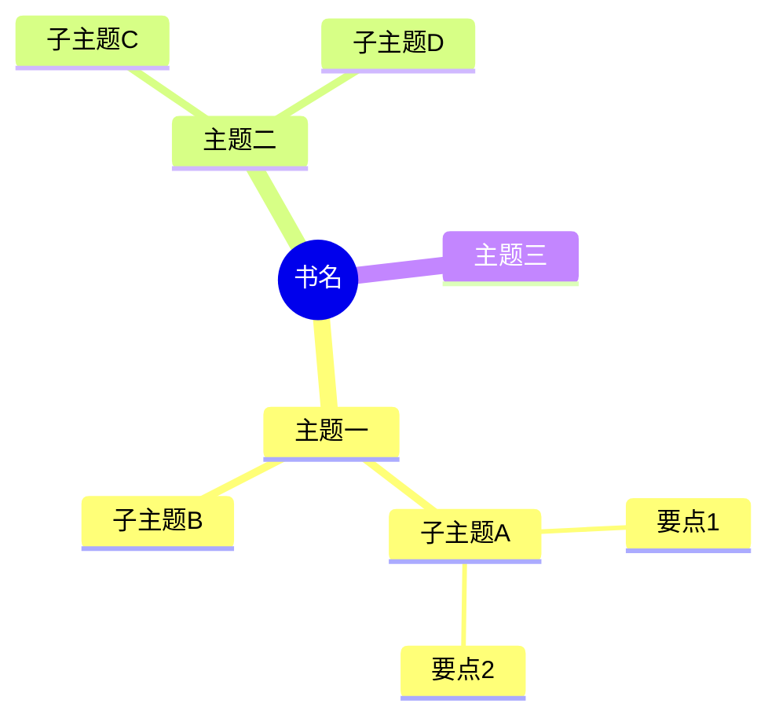
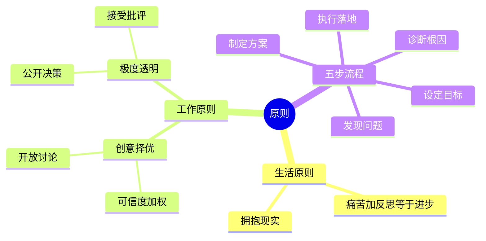

# 读书笔记整理工具

将杂乱的读书笔记转化为结构化的脑图与关键洞见。

## 与相邻工具的边界

本 SKILL 是阅读材料的“结构化归档”工具，只处理用户已经给出的笔记、摘录、书评或阅读感悟。

| 情况 | 决策 |
|---|---|
| 用户已经给出笔记，并明确要整理、脑图、大纲、归档、可视化 | 使用本 SKILL |
| 用户是在做通用任务管理、时间管理、目标拆解、执行复盘或习惯设计 | 转用 `personal-effectiveness-system` |
| 用户是在选书、读前、读中困惑、读后消化、想被考或想产出可调用资产 | 转用 `ai-era-reading` |
| 用户同时需要消化和归档 | 先用 `ai-era-reading` 完成理解检验与资产化，再用本 SKILL 整理最终材料 |

禁止用本 SKILL 代替理解检验：如果输入不是“已有笔记”，而是“我该怎么读 / 我读懂了吗”，应先路由到 `ai-era-reading`。

## 工作流程

收到读书笔记后，按以下顺序输出：

1. **解析笔记** — 识别书名/来源、核心主题、子主题、概念关系
2. **生成 Mermaid 脑图** — 层级清晰的思维导图
3. **生成 Markdown 大纲脑图** — 可折叠的层级结构
4. **提取关键笔记** — 最重要的 5-10 条洞见或金句

---

## 输出格式模板

ALWAYS 按以下结构输出，不要省略任何部分：

---

### 📚 《[书名]》读书笔记整理

**核心主题：** [一句话概括全书核心]

---

### 🗺️ Mermaid 脑图



**Mermaid 语法规则：**
- 根节点用 `root((文字))` 包裹（双圆括号）
- 缩进代表层级，每级 2 个空格
- 叶节点保持简洁（≤10 字）
- 最多 4 层深度，避免过于复杂
- 不要在节点文字中使用特殊字符（括号、引号等）

---

### 📋 Markdown 大纲脑图

用层级标题和缩进列表呈现，适合在 Obsidian / Notion 等工具中使用：

```markdown
# 《书名》

## 主题一
- **子主题A**
  - 要点1：说明
  - 要点2：说明
- **子主题B**
  - 要点

## 主题二
...
```

---

### 💡 关键笔记

提取最有价值的洞见，格式：

> **[洞见标题]**
> 原文或总结。适用场景或个人思考。

每条关键笔记包含：
- 核心观点（1-2句）
- 实际意义或应用场景（可选）

目标：提取 5-10 条，宁精勿滥。

---

## 解析策略

### 识别笔记结构
- **章节型**：按章节标题组织主题层级
- **流水型**：按主题聚类，归纳相似观点
- **金句型**：以金句为叶节点，归纳上级主题
- **混合型**：先提取显式结构，再补充隐式主题

### 脑图深度建议
| 笔记量 | 推荐层级 | 主题数量 |
|--------|----------|----------|
| < 500字 | 2层 | 3-5个主题 |
| 500-2000字 | 3层 | 4-7个主题 |
| > 2000字 | 4层（最大） | 5-10个主题 |

### 处理原则
- **忠于原文**：不过度解读，保留作者原意
- **突出重点**：用加粗标注用户标记过的重要内容
- **去除冗余**：合并相似观点，去掉重复表述
- **保持可用**：脑图要能直接渲染（Mermaid 语法正确）

---

## 用户输入处理

### 笔记格式识别
接受以下任意格式的输入：
- 纯文本流水笔记
- Markdown 格式笔记（带 #/##/- 等）
- 带页码的摘抄（"P.123: ..."）
- 混合中英文笔记
- 有/无书名的笔记

### 缺失信息处理
- **无书名**：从内容推断，或标注"[未知书目]"，在输出顶部询问
- **笔记过少**（< 3条）：生成脑图并提示"笔记较少，建议补充更多内容以获得更丰富的脑图"
- **笔记过多**（> 5000字）：分批处理，先处理前半部分，告知用户

---

## 示例

### 输入示例
```
《原则》Ray Dalio

- 痛苦+反思=进步，失败是最好的老师
- 可信度加权：听取经验值高的人的建议
- 极度透明：所有决策公开，接受批评
- 章节：生活原则 / 工作原则
- 五步流程：目标→问题→诊断→方案→执行
- 创意择优：好的想法来自任何人，不论职级
```

### 期望输出

**核心主题：** 通过系统化原则和极度透明实现个人与组织的持续进化

**Mermaid 脑图：**


**关键笔记示例：**
> **痛苦是进步的信号**
> "痛苦+反思=进步" — 将不舒适的经历视为学习机会而非需要回避的事情。每次失败后主动复盘，而非归咎于外部。
